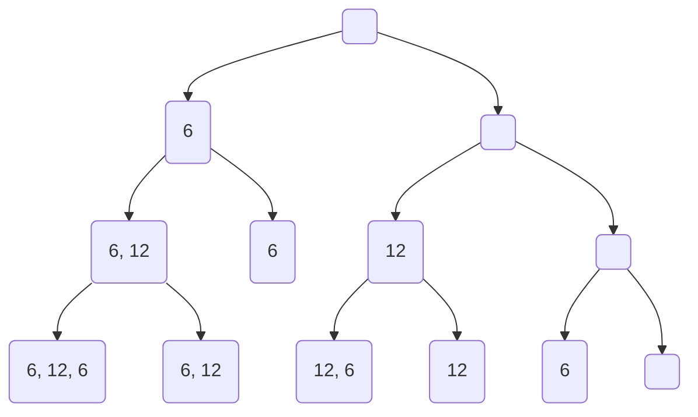

## Ejercicio 1

Conjunto de soluciones candidatas para C = {6, 12, 6} y k = 12

Serían todas las posibles combinaciones de 3 digitos que pueden ser 1 o 0:

```
000
001
010
011
100
101
110
111
```

Bien escrito:

```
{(0, 0, 0),
 (0, 0, 1),
 (0, 1, 0),
 (0, 1, 1),
 (1, 0, 0),
 (1, 0, 1),
 (1, 1, 0),
 (1, 1, 1)}
```
Conjunto de soluciones válidas para C = {6, 12, 6} y k = 12

{(1, 0, 1), (0, 1, 0)} o sea {(6, 6), (12)}

Conjunto de soluciones parciales para C = {6, 12, 6} y k = 12

Son todos los nodos del arbol



Resuelvo la recursion para el caso de C = {6, 12, 6} y k = 6.

$$
\begin{aligned}    
ss(C, k) &= ss([{6, 12, 6}], 6) \\
    &= ss([6, 12], 6) \lor ss([6, 12], 0) \\
    &= (ss([6, 12], 6) \lor ss([6, 12], 0)) \lor (ss([6, 12], 6) \lor ss([6, 12], 0)) \\
\end{aligned}
$$